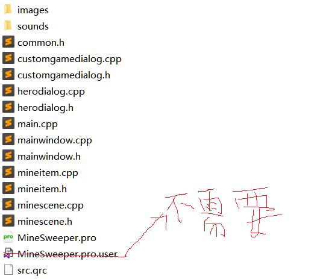
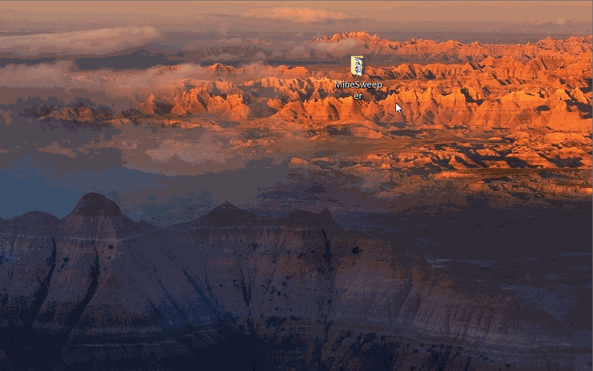
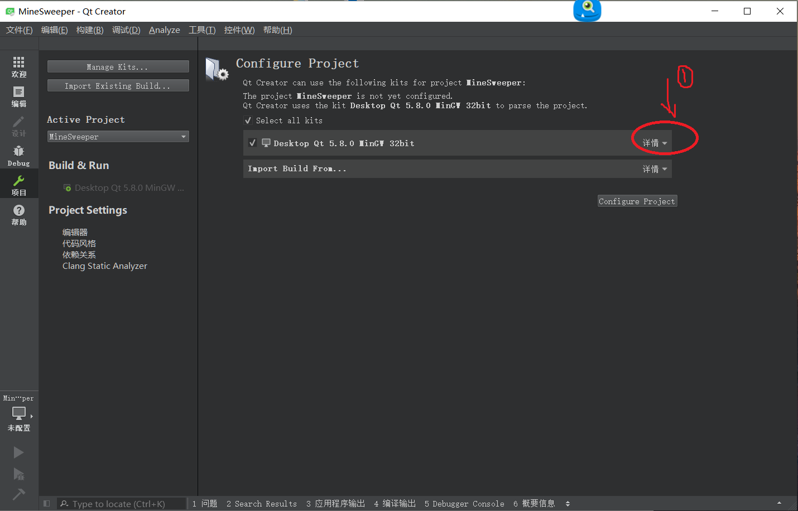
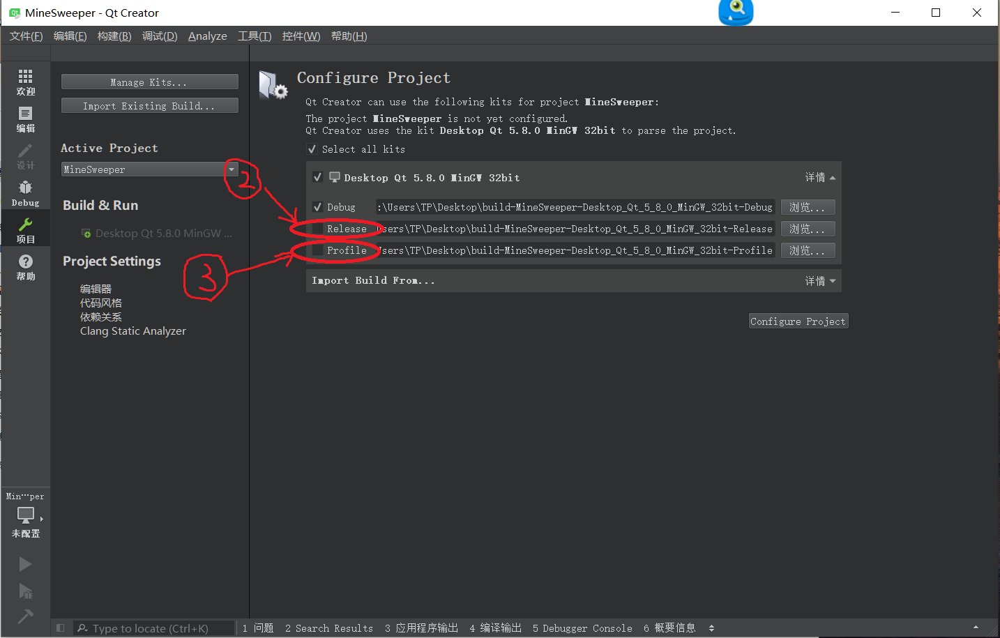
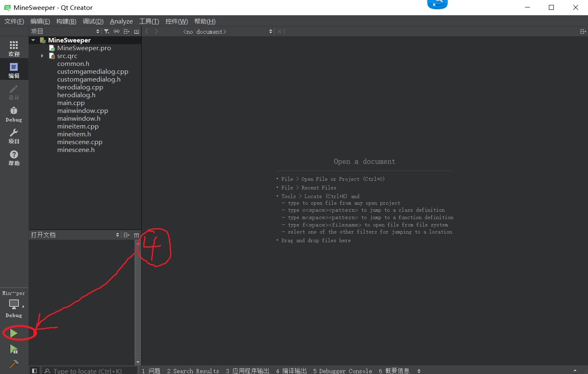
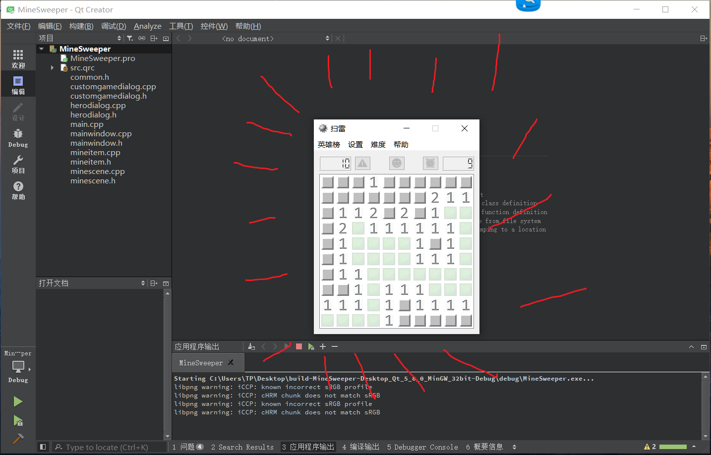

# 扫雷游戏，基于Qt实现
1.项目简介：windows下的扫雷小游戏。

2.功能特性：

3.环境依赖：本小游戏时在Qt Creator 4.2.1社区版下编译的。

##4.部署步骤：
  1.下载下面这些文件  
  
    
  
  2.将这些文件放入桌面的一个新建文件夹，例如下图 
  
    
  
  3.在你有安装***Qt Creator 4.2.1***的前提下，直接双击***MineSweeper.por***这个文件，会出现下面界面。
  
    
  
  4.点击详情后取消Realease和Profile
  
    
  
  5.点击界面桌面左下角的绿色播放按钮，等待***几分钟***
  
    
  
  6.然后就开始游戏吧
  
    

5.目录结构描述：

6.版本内容更新：

7.声明：

8.协议：

<<<----------------------------------------------------------------->>>

