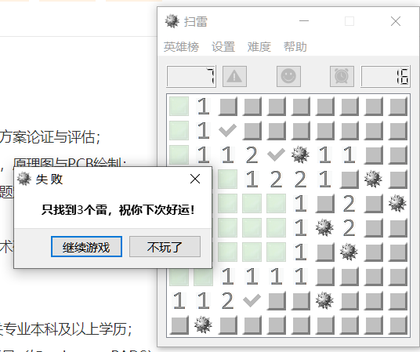

# 扫雷游戏，基于Qt实现
1.项目简介：windows下的扫雷小游戏。

2.功能特性：

3.环境依赖：本小游戏时在Qt Creator 4.2.1社区版下编译的。

4.部署步骤：
{
  1.下载
}

5.目录结构描述：

6.版本内容更新：

7.声明：

8.协议：

<<<----------------------------------------------------------------->>>

